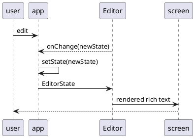

# Core

## Components

### Editor



```tsx
import { Editor, EditorState } from 'draft-js';

const MyInput = () => {
  const [editorState, setEditorState] = useState(() =>
    EditorState.createEmpty(),
  );

  return <Editor editorState={editorState} onChange={setEditorState} />;
};
```

#### EditorState

> Snapshot of the full state of editor.

##### RichUtils

> utils to help manipulate inline and block styles EditorState

##### Modifier

> functions that apply edits, including changes to text, styles and more, returns the desired EditorState.

So what's the differencce with RichUtils?

#### Entity

> an object that represents metadata for a range of text within a Draft editor. It has three properties.

#### how to access Entity

```ts
interface EditorState {
  // other properties...
  getCurrentContent: ContentState; // including all entities
}
```

##### create

```ts
const contentState = editorState.getCurrentContent();
const contentStateWithEntity = contentState.createEntity('LINK', 'MUTABLE', {
  url: 'http://www.zombo.com',
});
const entityKey = contentStateWithEntity.getLastCreatedEntityKey();
const contentStateWithLink = Modifier.applyEntity(
  contentStateWithEntity,
  selectionState,
  entityKey,
);
const newEditorState = EditorState.set(editorState, {
  currentContent: contentStateWithLink,
});
```

##### get

```ts
const contentState = editorState.getCurrentContent();
const blockWithLinkAtBeginning = contentState.getBlockForKey('...');
const linkKey = blockWithLinkAtBeginning.getEntityAt(0);
const linkInstance = contentState.getEntity(linkKey);
const { url } = linkInstance.getData();
```

#### entity interface

```ts
interface Entity {
  type: 'Link' | 'MENTION' | 'PHOTO'; // ... other types
  mutability: object; // denotes the behavior of a range of text annotated with this entity object when editing the text range within the editor.
  data: object;
}
```
